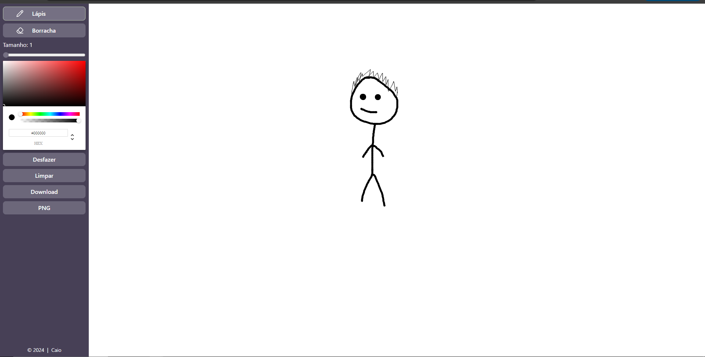
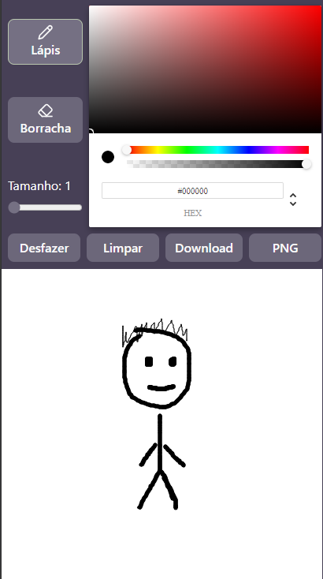
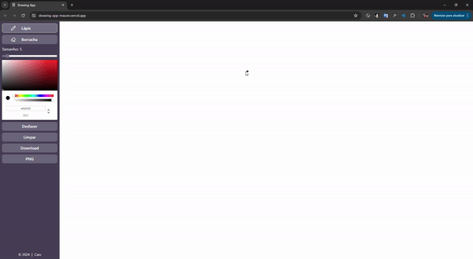

## 🖼 Imagens

## 📌 Sobre

**Drawing-app** é um site para desenhar.

## 🚀 Tecnologias utilizadas

O projeto foi desenvolvido utilizando as seguintes tecnologias:

- [Vite](https://vitejs.dev/)
- [Typescript](https://www.typescriptlang.org/)
- [Tailwindcss](https://tailwindcss.com/)
- [Lucide-react](https://lucide.dev/)
- [React-color](https://github.com/casesandberg/react-color)

## 💻 O projeto pode ser vizualizado acessando o seguinte link

<https://drawing-app-mauve.vercel.app/>

## 📦  Exemplo

